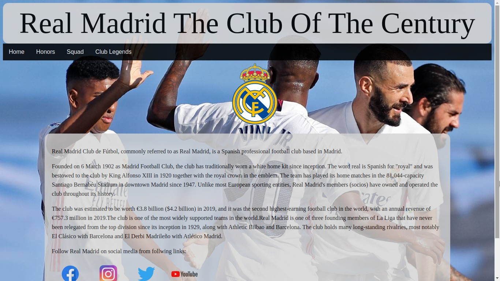

# REAL MADRID- The Club Of The Century

---

### Table of Contents
You're sections headers will be used to reference location of destination.

- [Description](#description)
- [Preview](#preview)
- [Back to top](#real-madrid--the-club-of-the-century)
- [Author Info](#author-info)

---

## Description
[Back to top](#real-madrid--the-club-of-the-century)

This website is designed to showcase HTML and CSS concepts.
This is an descriptive website design which contains information about first team of the club.

#### Technologies

- HTML5
- CSS3

---
## Preview
[Back to top](#real-madrid--the-club-of-the-century)

---

---

---

## How To Use
[Back to top](#real-madrid--the-club-of-the-century)

### How to download

#### Cloning this repository using the command line.

- Open Terminal.
- Change the current working directory to the location where you want the cloned directory.
- Type ``git clone``, and then type https://github.com/dexter083/real-madrid.git.
- Press **Enter** to create your local clone.

#### How to open. [Back to top](#real-madrid--the-club-of-the-century)
- Open the folder.
- Click on index.html to view the home page
- Feel free to navigate around.

---

## Author Info

- LinkedIn - [Mohit Saini](https://www.linkedin.com/in/mohitsaini083/)

---
[Back to top](#real-madrid--the-club-of-the-century)
